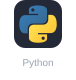
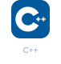
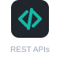

# 👨‍💻 Darshan Shah - Software Developer

## 📌 About Me

Computer Applications graduate currently pursuing an MSc in Digital Technologies at Ostfalia University, Germany. Software Developer focused on backend systems, database management, web applications, and AI-powered tools.

---

## 💻 Tech Stack

**Programming Languages**

  &nbsp;&nbsp;&nbsp;&nbsp;&nbsp;&nbsp;&nbsp;&nbsp;

**Backend & Databases**

  &nbsp;&nbsp;&nbsp;&nbsp;&nbsp;&nbsp;&nbsp;&nbsp;

**Cloud & DevOps**

  &nbsp;&nbsp;&nbsp;&nbsp;&nbsp;&nbsp;&nbsp;&nbsp;

**Web Development**

  &nbsp;&nbsp;&nbsp;&nbsp;&nbsp;&nbsp;&nbsp;&nbsp;

**AI/ML Technologies**

  &nbsp;&nbsp;&nbsp;&nbsp;&nbsp;&nbsp;&nbsp;&nbsp;

**Tools**

  &nbsp;&nbsp;&nbsp;&nbsp;

---

## 🚀 Projects

### 🔹 [PeCal Pulse](https://github.com/DarshanScripts/pecal-pulse)

AI sales assistant that turns calibration history into customer priorities, forecasts, and follow-ups, with a voice agent that can operate the interface. First place at Hack The Lab by Perschmann Calibration.

### 🔹 [Stratego LLM Agent](https://github.com/DarshanScripts/stratego)

LLM benchmarking framework evaluating strategic reasoning, token efficiency, and gameplay behavior across Mistral, Gemma, Llama, and Qwen.

### 🔹 [Domain Modeling Copilot](https://github.com/DarshanScripts/domain-modelling-copilot)

LLM-driven assistant that converts natural language requirements into structured domain models and UML diagrams.

### 🔹 [AlphaChat](https://github.com/DarshanScripts/alphachat)

Multimodal AI chatbot with voice interaction, image generation, web search, and PDF summarization.

### 🔹 [Flight Booking System](https://www.linkedin.com/in/darshan-shah-tech/details/projects/)

A complete ticket reservation platform with multilingual support, reCAPTCHA, payments, and voice assistant.

### 🔹 [Daily Expense Tracker](https://github.com/DarshanScripts/daily-expense-tracker)

Android app to track income and expenses with to-do list, camera integration, SMS, and reminders.

### 🔹 [Property Management System](https://github.com/DarshanScripts/property-management-system)

JSP-based solution for landlords with tenant handling, rent logs, and maintenance reports.

### 🔹 [Online Shopping System](https://github.com/DarshanScripts/online-shopping-system)

PHP-based shopping platform with CRUD operations, AJAX, cart, admin panel, and login/logout.

### 🔹 [Insurance Management System](https://github.com/DarshanScripts/insurance-management-system)

Web app for managing insurance policies, customers, and admin operations with CRUD and AJAX.

### 🔹 [Contest Management System](https://github.com/DarshanScripts/contest-management-system)

PHP/MySQL system with form handling, file management, secure login, AJAX reports, and admin dashboard.

### 🔹 [Food on Track](https://github.com/DarshanScripts/food-on-track)

Web app for train passengers to order food with cart, order management, and admin controls.

---

## 📫 Contact Me

  
  
  
  
  
  
  
  
  

---

## 📊 GitHub Stats

  
  &nbsp;
  
  &nbsp;
  

---

Explore my work and don't hesitate to connect if you're looking for a reliable developer for freelance or team projects.
